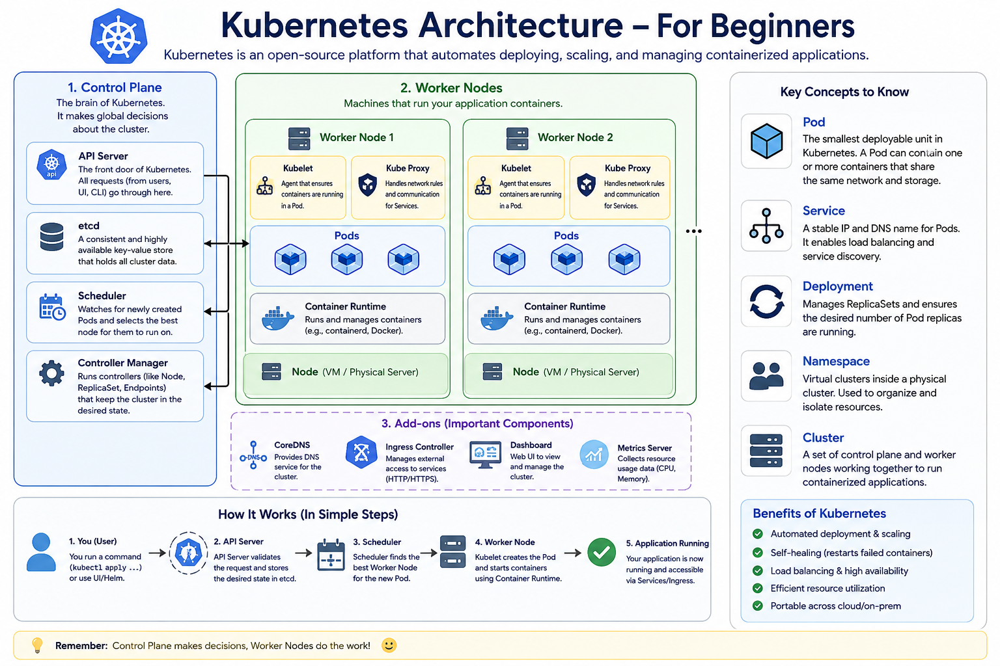
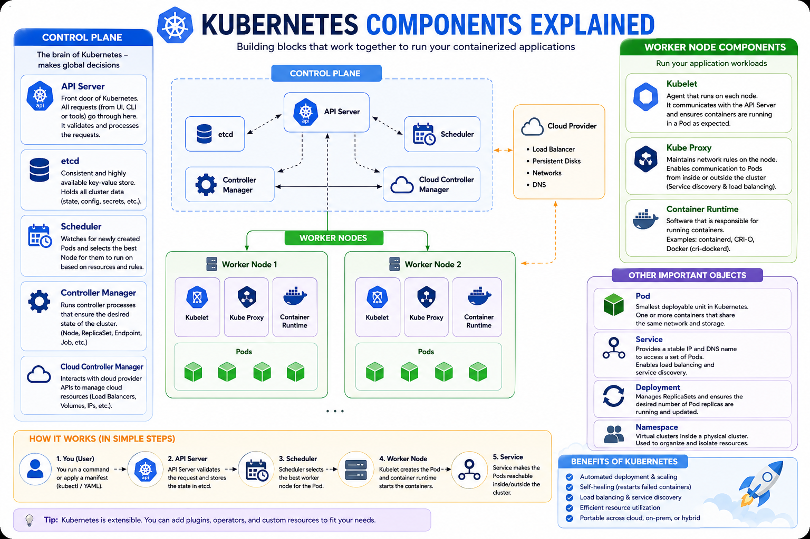

# Kubernetes Architecture for Beginners

This repository contains beginner-friendly Kubernetes architecture diagrams designed to help learners understand the core components of a Kubernetes cluster and how they interact.

### 1. Kubernetes Architecture – For Beginners
- Control Plane components
- Worker Nodes
- Pods and Containers
- CoreDNS, Ingress Controller, Dashboard, and Metrics Server
- Application deployment workflow

## Architecture Diagram

## Components Diagram

## How Kubernetes Works

1. User submits a deployment request using kubectl.
2. API Server validates the request.
3. Desired state is stored in etcd.
4. Scheduler selects the best worker node.
5. Kubelet starts the containers.
6. Service exposes the application.
7. Controllers maintain the desired state.

## Benefits

- Automated deployment
- Self-healing applications
- Horizontal scaling
- Load balancing
- High availability
- Efficient resource utilization

## Recommended Learning Path

1. Linux Fundamentals
2. Docker
3. Kubernetes Basics
4. Deployments & Services
5. Networking & Ingress
6. Helm
7. Monitoring & Logging
8. CI/CD Integration

## Target Audience

- Beginners
- DevOps Engineers
- Cloud Engineers
- SREs
- Students preparing for CKA/CKAD/CKS
